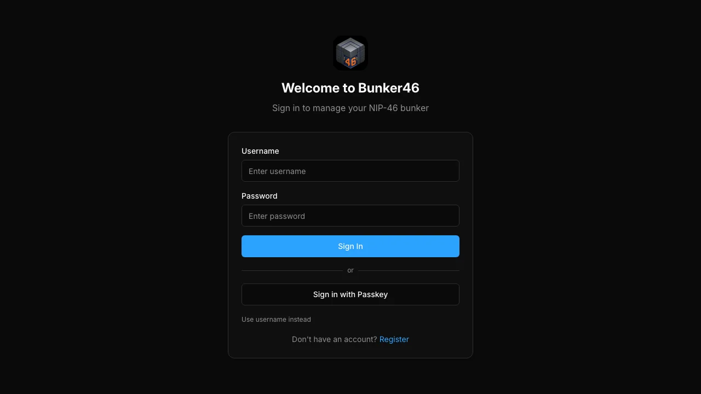
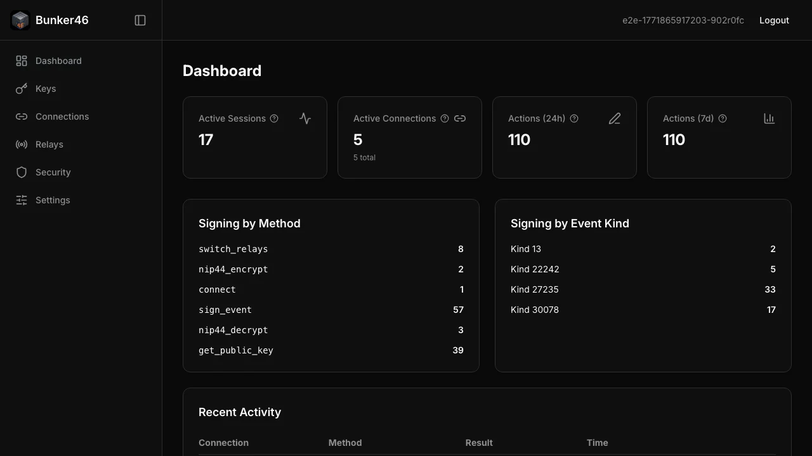
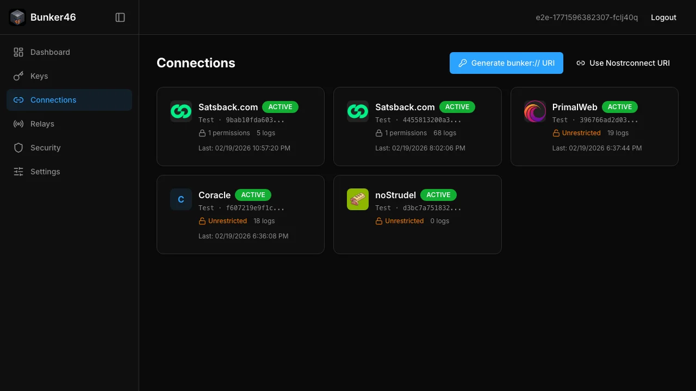
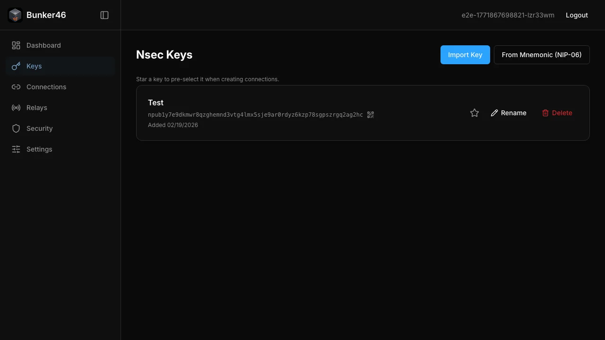

# Bunker46

[](https://github.com/dsbaars/bunker46/actions/workflows/ci.yml)
[](https://www.typescriptlang.org/)
[](https://vuejs.org/)
[](https://nodejs.org/)
[](https://pnpm.io/)
[](LICENSE)

A modern, secure NIP-46 Nsec Bunker management tool built with TypeScript.

## Screenshots

| Login                                                                | Dashboard                                                                        |
| -------------------------------------------------------------------- | -------------------------------------------------------------------------------- |
| [](docs/screenshots/login.webp) | [](docs/screenshots/dashboard.webp) |

| Connections                                                                            | Keys                                                              |
| -------------------------------------------------------------------------------------- | ----------------------------------------------------------------- |
| [](docs/screenshots/connections.webp) | [](docs/screenshots/keys.webp) |

Screenshots are captured with Playwright (WebP). The connections screenshot uses mocked API data. To regenerate: run `pnpm dev` in one terminal, then `pnpm run e2e:screenshots`.

## Stack

| Layer        | Technology                                                                   |
| ------------ | ---------------------------------------------------------------------------- |
| **Frontend** | Vue 3, Vite 7, Tailwind CSS v4, shadcn-vue, nanostores, localforage          |
| **Backend**  | NestJS 11, Fastify, Prisma ORM 7 (driver adapter), nostr-tools               |
| **Database** | PostgreSQL 17                                                                |
| **Auth**     | JWT + Argon2, TOTP (otplib), WebAuthn/Passkeys (@simplewebauthn)             |
| **Testing**  | Vitest, Playwright, eslint-plugin-security                                   |
| **Infra**    | Docker, Docker Compose, Node 24, pnpm 10, Redis (optional, for live updates) |

## Architecture

```
bunker46/
├── apps/
│   ├── server/          # NestJS + Fastify backend
│   │   ├── src/
│   │   │   ├── auth/    # JWT, TOTP, WebAuthn, session management
│   │   │   ├── bunker/  # NIP-46 RPC handler, relay pool, URI parsing
│   │   │   ├── connections/ # CRUD for bunker connections & permissions
│   │   │   ├── events/  # Redis pub/sub, SSE stream (live dashboard/connections)
│   │   │   ├── logging/ # Signing logs & dashboard stats
│   │   │   ├── users/   # User management
│   │   │   ├── prisma/  # Database service
│   │   │   └── common/  # Encryption, guards, interceptors
│   │   └── prisma/      # Schema & migrations
│   └── web/             # Vue 3 SPA
│       ├── src/
│       │   ├── components/ # UI components (shadcn-style)
│       │   ├── views/     # Route views
│       │   ├── stores/    # nanostores + localforage
│       │   ├── router/    # Vue Router
│       │   └── lib/       # API client, utilities
│       └── e2e/          # Playwright E2E tests
├── packages/
│   ├── shared-types/    # Zod schemas & TypeScript types
│   ├── config/          # Environment config & constants
│   ├── tsconfig/        # Shared TypeScript configs
│   └── eslint-config/   # Shared ESLint configs
├── docker-compose.yml   # Production Docker Compose
└── docker-compose.dev.yml # Dev services (DB, Redis)
```

## Quick Start

### Prerequisites

- Node.js >= 24
- pnpm >= 10
- Docker & Docker Compose (for database)

### Development

```bash
# Install dependencies
pnpm install

# Start database services
docker compose -f docker-compose.dev.yml up -d

# Copy environment config
cp .env.example .env
# Optional: set REDIS_URL=redis://localhost:6379 in .env for live dashboard/connections updates

# Generate Prisma client (required; runs automatically on pnpm install) & run migrations
pnpm db:generate
pnpm db:migrate
# Optional: seed the database (Prisma 7 does not auto-seed after migrate)
# pnpm --filter @bunker46/server run db:seed

# Start dev servers (backend + frontend)
pnpm dev
```

The frontend will be available at `http://localhost:5173` and the API at `http://localhost:3000`. With Redis running and `REDIS_URL` set, the dashboard and connections list refresh automatically when activity occurs.

If ports 3000 or 5173 are already in use (e.g. a previous dev run didn’t exit cleanly), free them and restart:

```bash
pnpm kill-port
pnpm dev
```

### Testing

```bash
# Run all unit/integration tests
pnpm test

# Run with coverage
pnpm test:coverage

# Run E2E tests (Playwright; starts full stack from repo root so API works)
pnpm e2e

# If you already have `pnpm dev` running, reuse it to avoid port conflicts:
# CI= pnpm e2e

# Run E2E with UI
pnpm e2e:ui

# Lint (includes security rules)
pnpm lint

# Security-specific lint
pnpm lint:security
```

### Production (Docker)

```bash
# Build and run all services
docker compose up --build

# Access the application
open http://localhost:8080
```

## NIP-46 Implementation

This tool implements the full [NIP-46 Nostr Remote Signing](https://nips.nostr.com/46) specification:

- **URI Support**: Parse and generate both `bunker://` and `nostrconnect://` URIs
- **All RPC Methods**: `connect`, `sign_event`, `ping`, `get_public_key`, `nip04_encrypt/decrypt`, `nip44_encrypt/decrypt`, `switch_relays`
- **Fine-grained Permissions**: Per-connection method and event kind restrictions
- **NIP-44 Encryption**: All communication encrypted using NIP-44
- **Auth Challenges**: Support for out-of-band authentication
- **Relay Management**: Configurable relays per connection with automatic reconnection

## Security

- Private keys (nsecs) are encrypted at rest using AES-256-GCM
- Passwords hashed with Argon2
- 2FA via TOTP and WebAuthn/Passkeys
- JWT with short-lived access tokens and refresh token rotation
- **Session management**: list active sessions (with IP and user-agent), revoke a session, or log out all other sessions
- HTTP-only secure cookies option
- Security ESLint rules enforced
- Non-root Docker containers

## Dependencies

To check for outdated packages across the monorepo:

```bash
pnpm outdated -r
```

Several dependencies have newer major versions available (e.g. Prisma 7, Vitest 4, Vue Router 5, Zod 4). Upgrade when ready and run tests; pin to current majors if you prefer stability.

## License

MIT
